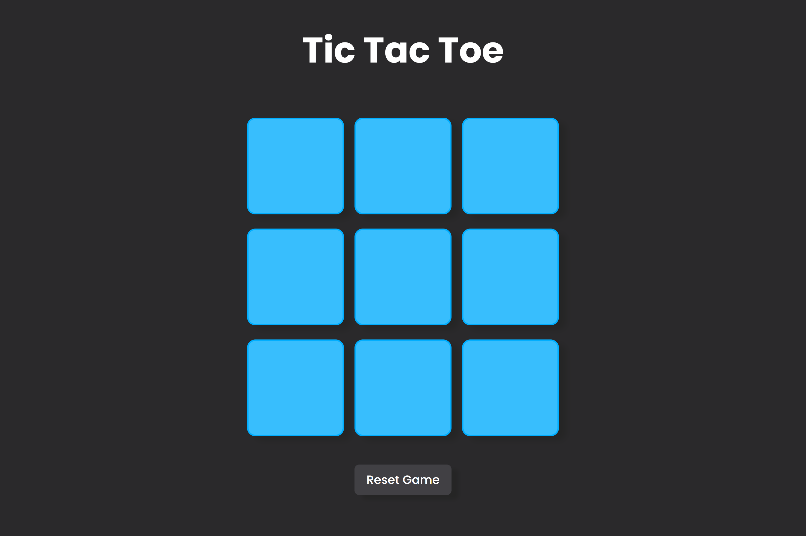
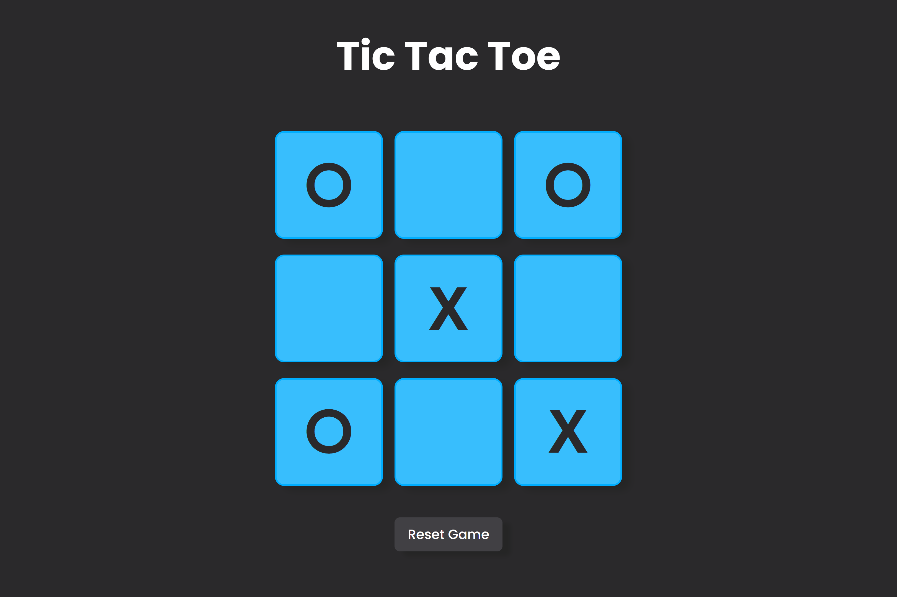

# Tic Tac Toe Game



A simple and interactive Tic Tac Toe game built with HTML, CSS, and JavaScript.

## Table of Contents

- [Features](#features)
- [Demo](#demo)
- [Getting Started](#getting-started)
- [How to Play](#how-to-play)
- [Contributing](#contributing)

## Features

- Play Tic Tac Toe against a friend or yourself!
- Responsive design for desktop and mobile devices.
- Reset the game or start a new one with ease.

## Demo




## Getting Started

To get started, simply clone the repository and open the `index.html` file in your browser.

```bash
git clone https://github.com/kx56/tic-tac-toe.git
cd tic-tac-toe
```

## How to Play

- Click on the game board to place your 'O' or 'X'.
- Try to get three in a row horizontally, vertically, or diagonally.
- The game will notify you of the winner or a draw.

## Contributing
Contributions are welcome! If you'd like to contribute to the project, please follow these steps:

- Fork the repository.
- Create a new branch: git checkout -b feature/new-feature.
- Make your changes and commit them: git commit -m 'Add a new feature'.
- Push to the branch: git push origin feature/new-feature.
- Submit a pull request.
